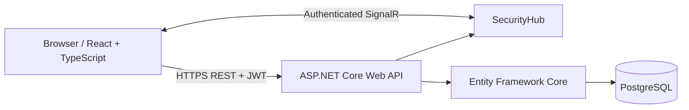
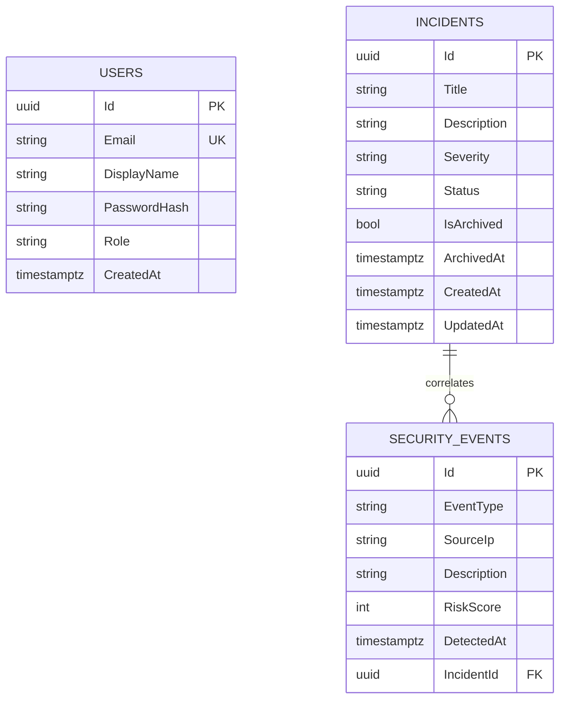
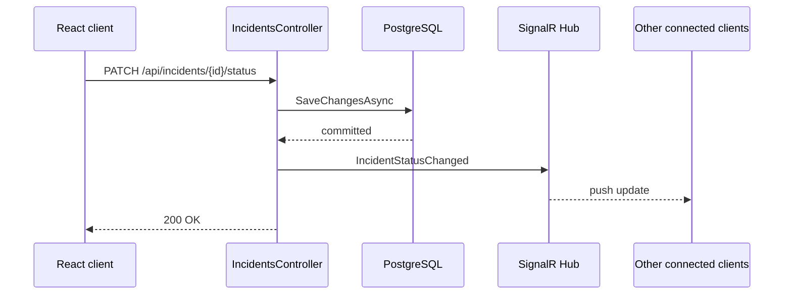

# SentinelDesk Architecture

SentinelDesk is a layered full-stack security-operations application. The system deliberately separates persistence, API workflow rules, real-time delivery, and presentation so each concern can evolve independently.

## System view



The REST API is authoritative for state changes. SignalR only broadcasts a database change after persistence succeeds, so a failed real-time delivery never rolls back a valid database operation.

## Main components

### React frontend

The frontend is under `frontend/SentinelDesk.Web`.

Responsibilities:

- authentication and local session lifecycle
- typed REST clients
- one reusable authenticated SignalR connection
- dashboard metrics and live event stream
- incident CRUD/workflow UX
- telemetry ingestion and incident correlation
- role-aware controls
- analytics and CSV reporting

### ASP.NET Core API

The backend is under `backend/SentinelDesk.Api`.

Controllers are intentionally workflow-oriented rather than exposing EF entities as unrestricted CRUD:

- `AuthController` — first-run Admin bootstrap and JWT login
- `UsersController` — Admin-only account provisioning
- `IncidentsController` — incident search, mutation, state transitions, soft archive
- `SecurityEventsController` — telemetry ingestion and correlation
- `HealthController` — health probe

### PostgreSQL + Entity Framework Core

EF Core owns the relational schema and migrations. User credentials are stored only as password hashes.

Core relationships:



Security events are not deleted when an incident is archived. Their optional incident relationship is preserved for investigation history.

## Incident workflow

SentinelDesk enforces one-way status transitions on the server:

```text
Open → Investigating → Contained → Resolved → Closed
```

Invalid jumps return `409 Conflict`. `Closed` is terminal. Archive is a separate soft-delete operation rather than a workflow status.

## Authentication and authorization

SentinelDesk uses JWT bearer authentication for REST and SignalR.

The first-run bootstrap endpoint is available only while the Users table is empty. It creates the initial Admin account. After initialization, public registration is closed and Admins provision additional accounts through the protected Users API.

| Role | Read dashboard/data | Create/update incidents | Change incident status | Record/link telemetry | Archive incidents | Provision users |
| --- | --- | --- | --- | --- | --- | --- |
| Viewer | Yes | No | No | No | No | No |
| Analyst | Yes | Yes | Yes | Yes | No | No |
| Admin | Yes | Yes | Yes | Yes | Yes | Yes |

SignalR connections must also present a valid JWT.

## Real-time event flow

For a typical incident status update:



Broadcast failures are logged but do not invalidate already-committed database state.

## Configuration and secrets

Local PostgreSQL credentials use .NET User Secrets. Production secrets belong in the hosting provider's secret/environment configuration.

Required production values include:

- `ConnectionStrings__DefaultConnection`
- `Jwt__Key`
- `Cors__AllowedOrigins`

The frontend uses `VITE_API_BASE_URL` to locate the public API.

## Design decisions

- **Soft archive instead of delete:** incident history is valuable in security operations.
- **Server-enforced state machine:** the UI cannot bypass response workflow rules.
- **DTOs for writes and real-time messages:** persistence models are not accepted blindly from clients.
- **Explicit CORS allowlist:** required because SignalR uses credentials.
- **One SignalR connection per client:** avoids duplicate listeners and polling.
- **Free/open-source stack:** .NET, React, PostgreSQL, EF Core, SignalR, Vite, and Git tooling require no paid development license for this project.
